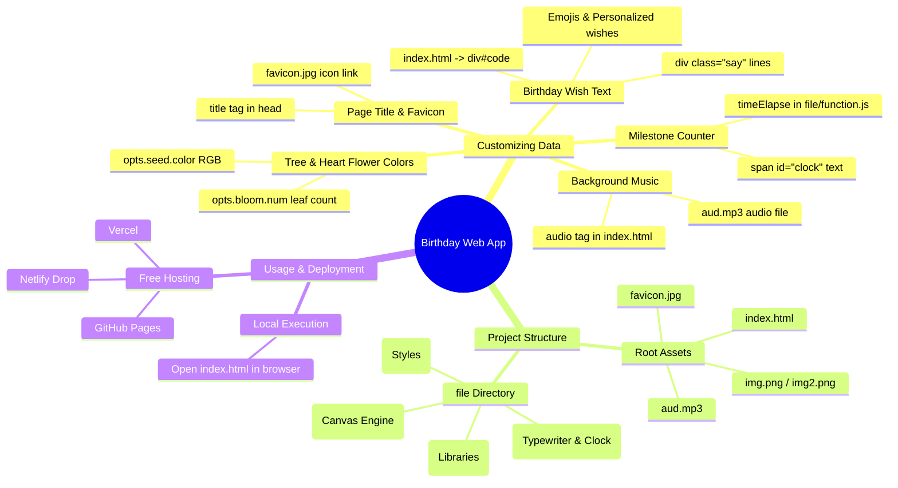
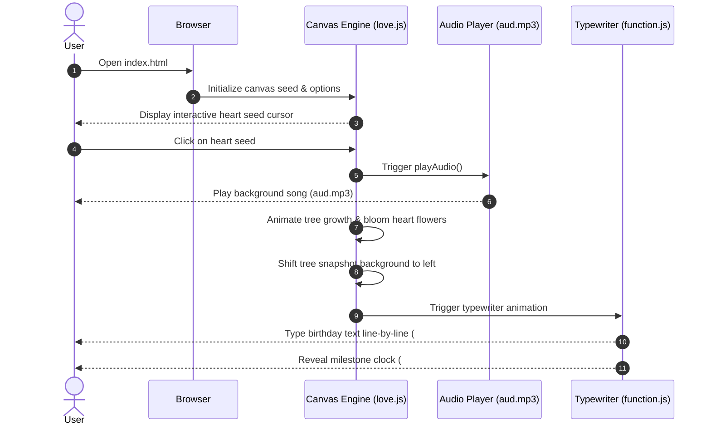

# 🎂 Birthday Wishing Web Application

An interactive, animated HTML5/JavaScript web page for sending personalized birthday wishes. It features an interactive animated canvas tree blooming with heart-shaped leaves, smooth typewriter text animations, background audio playback, and a customizable counter.

---

## 🧠 Project Mind Map & Architecture

### 📊 Mind Map



---

### 🔄 Data & Execution Flow Sequence



---

## ✨ Features

- 🌳 **Interactive Canvas Tree Animation:** Interactive seed click that grows a tree with blooming heart-shaped flowers.
- ✍️ **Typewriter Wish Animation:** Dynamic typing animation displaying your personalized birthday message.
- 🎵 **Background Music:** Automatic audio playback upon user interaction.
- ⏳ **Customizable Counter / Clock:** Display days, hours, minutes, and seconds for special milestones.
- 📱 **Responsive & Lightweight:** Pure HTML5, CSS3, and JavaScript with zero external build tools required.

---

## 🛠️ How to Customize the Project Data

You can easily personalize this project for any person (sister, brother, friend, partner, etc.) by modifying the data files and HTML markup.

### 📍 Quick Data Customization Cheat Sheet

| Customization Target | File Location | Line / Setting | Description |
|---|---|---|---|
| ✍️ **Birthday Wish Messages** | `index.html` | Lines 34–43 (`div.say`) | Custom birthday wishes text & emojis |
| 🎵 **Background Song** | `aud.mp3` or `index.html` | Lines 27–30 (`<audio>`) | Replace `aud.mp3` audio file |
| 🏷️ **Page Tab Title** | `index.html` | Line 5 (`<title>`) | Custom tab title (e.g. `HBD Bestie`) |
| 🖼️ **Favicon Icon** | `favicon.jpg` or `index.html` | Line 6 (`<link rel="icon">`)| Custom browser tab icon |
| ⏰ **Milestone Clock Text** | `index.html` | Line 48 (`#clock`) | Custom text or days count |
| 🎨 **Tree Heart Flower Color** | `index.html` | Line 71 (`opts.seed.color`) | RGB color (e.g. `rgb(190, 26, 37)`) |
| 🌸 **Flower Density Count** | `index.html` | Line 93 (`opts.bloom.num`) | Number of heart flowers (e.g., `700`) |
| ⚡ **Typewriter Speed** | `file/function.js` | Line 32 | Typing interval delay in milliseconds (default: `75ms`) |

---

### 1. ✍️ Customizing the Birthday Wishes Text

Open `index.html` in any code or text editor and locate the `<div id="code">` section (around lines 33–44):

```html
<div id="code">
    <div class="say">Your Greeting Header 🎂</div>
    <div class="say">Your personalized birthday message line 1...</div>
    <div class="say">Your personalized birthday message line 2...</div>
    <div class="say">Wish them happiness and success! ✨</div>
    <div class="say">by [Your Name] 💕</div>
</div>
```

- **Adding lines:** Add a new `<div class="say">Your new text here</div>` block.
- **Removing lines:** Delete any existing line.
- **Formatting & Emojis:** You can include emojis, custom symbols, or HTML styling directly.

---

### 2. 🎵 Changing the Background Music

The audio file played when clicking the heart seed is specified in `index.html`:

1. Replace `aud.mp3` in the root folder with your chosen `.mp3` audio track.
2. Or change the filename reference in `index.html`:

```html
<audio autoplay="autoplay" height="100" width="100" id="myAudio">
    <source src="aud.mp3" type="audio/mp3" />
    <embed height="100" width="100" src="aud.mp3" />
</audio>
```

> **Note on Audio Autoplay:** Modern browsers restrict unmuted audio from playing automatically without user interaction. The script handles this by starting audio playback upon the user's initial click on the canvas seed!

---

### 3. 🏷️ Updating Page Title & Favicon

In `index.html`, modify the `<head>` section:

```html
<!-- Website Title in Tab -->
<title>HBD Akka</title>

<!-- Favicon Image -->
<link rel="icon" type="image/svg+xml" href="favicon.jpg" />
```

- Update `HBD Akka` to your custom title (e.g. `Happy Birthday Bestie!`).
- Replace `favicon.jpg` with your own photo or icon file.

---

### 4. ⏰ Customizing the Milestone Clock / Counter

The clock text is located in `index.html` (around line 48):

```html
<div id="clock-box">
    <span id="clock">577 days 24 hours 60 minutes 60 seconds</span>
</div>
```

#### Automated Live Elapsed Time Counter:
To calculate live days/hours/minutes dynamically since a birthdate or anniversary, call `timeElapse(date)` from `file/function.js` inside `index.html`:

```javascript
// Example: Set birth date or special date (Year, Month - 1, Day, Hour, Minute)
var together = new Date();
together.setFullYear(2000, 0, 15); // Jan 15, 2000
together.setHours(0);
together.setMinutes(0);
together.setSeconds(0);

timeElapse(together);
```

---

### 5. 🎨 Customizing Tree Colors & Animation Settings

Inside `index.html` (around lines 68–102), you can adjust the JavaScript options for the canvas tree:

```javascript
var opts = {
    seed: {
        x: width / 2 - 20,
        color: "rgb(190, 26, 37)", // Change seed & heart flower color (RGB)
        scale: 2
    },
    bloom: {
        num: 700, // Number of blooming heart flowers on the tree
        width: 1080,
        height: 650,
    },
    footer: {
        width: 1200,
        height: 5,
        speed: 10,
    }
}
```

- **`seed.color`**: Change `rgb(190, 26, 37)` to any RGB color value (e.g., `rgb(255, 105, 180)` for hot pink or `rgb(138, 43, 226)` for purple).
- **`bloom.num`**: Increase or decrease the density of blooming heart flowers on the tree branches.

---

### 6. 🎨 Customizing Background & Font Styles

Open `file/default.css` to modify background colors, font sizes, or text colors:

```css
body {
  background-color: #000; /* Solid black background */
  color: white;
  font-family: sans-serif;
}

#code {
  color: rgb(196, 255, 255); /* Typewriter text color */
  font-size: 16px;
  line-height: 25px;
}
```

---

## 📁 Repository Directory Structure

```text
Birthday/
├── index.html          # Main HTML entry point containing text & animation scripts
├── aud.mp3             # Background audio track
├── favicon.jpg         # Favicon icon image
├── img.png             # Asset image
├── img2.png            # Asset image
├── README.md           # Project documentation
└── file/
    ├── default.css     # Main stylesheet (layout, fonts, positioning)
    ├── function.js     # Typewriter logic and time elapse utility functions
    ├── love.js         # Canvas engine for tree, heart petals, and animation loops
    ├── jquery.min.js   # jQuery library
    └── jscex*.js       # Jscex async execution scripts for smooth sequencing
```

---

## 🚀 How to Run Locally

1. **Clone the repository:**
   ```bash
   git clone https://github.com/Monishwarann/Birthday.git
   ```
2. **Navigate into the project directory:**
   ```bash
   cd Birthday
   ```
3. **Open `index.html`:**
   - Double-click `index.html` to open it directly in your web browser (Chrome, Firefox, Edge, Safari).
   - Alternatively, serve it using a local dev server (e.g. VS Code Live Server or `npx serve`).

---

## 🌐 How to Deploy (Free Hosting)

- **GitHub Pages:** Go to your repository **Settings** > **Pages** > Select `main` branch > Click **Save**.
- **Netlify / Vercel:** Drag and drop the repository folder onto Netlify Drop or import via Vercel for instant public URL link deployment.

---

## ❓ Frequently Asked Questions (FAQ) & Troubleshooting

<details>
<summary><b>1. Why isn't background audio playing automatically when opening the page?</b></summary>
<br/>
Modern web browsers (Chrome, Edge, Safari) block automatic audio playback until the user interacts with the web page. In this app, audio starts as soon as the user clicks the seed/heart on the canvas!
</details>

<details>
<summary><b>2. How do I change the typewriter animation speed?</b></summary>
<br/>
In <code>file/function.js</code>, find line 32: <code>}, 75);</code>. Lower numbers (e.g., <code>30</code>) make typing faster, while higher numbers (e.g., <code>120</code>) make typing slower.
</details>

<details>
<summary><b>3. How do I change the text color of the birthday wish?</b></summary>
<br/>
In <code>file/default.css</code>, update the <code>color</code> property under <code>#code</code> (e.g., <code>color: #ff69b4;</code>).
</details>

---

## 📄 License

This project is open-source and free to use for personal celebrations and customization.
